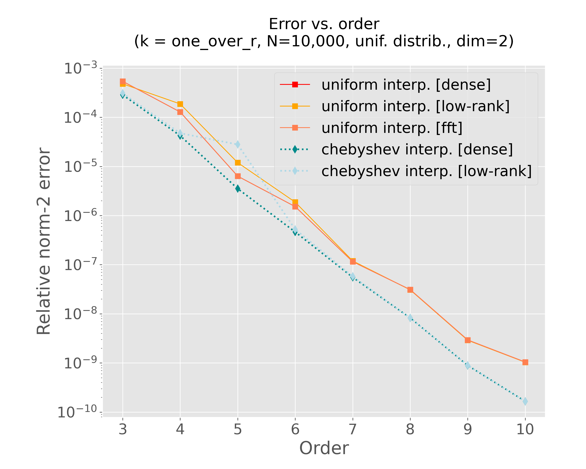
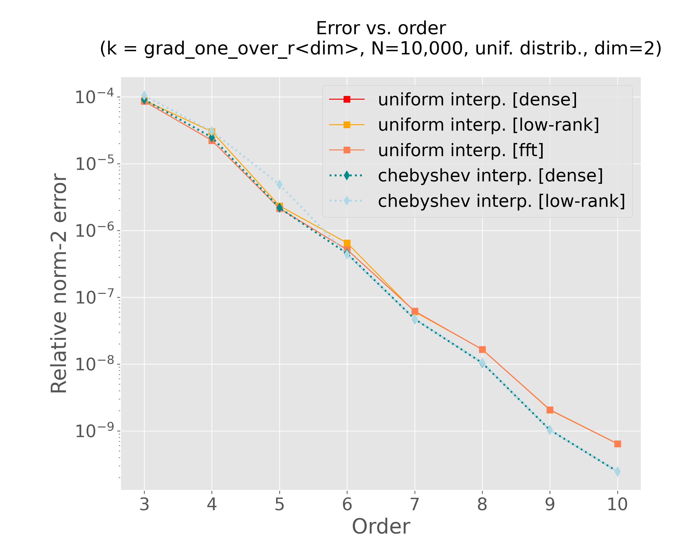

# -*- Coding: utf-8 -*-
# -*- coding: org -*-

#+title: ScalFMM experiments for the next release (draft)
#+author: Antoine Gicquel
#+date: {{{time(%d/%m/%Y at %H:%M:%S)}}}

:macro:
#+MACRO: scalfmm [[https://gitlab.inria.fr/solverstack/ScalFMM][ScalFMM]]
:end:

#+setupfile: https://compose.gitlabpages.inria.fr/include/compose-themes/theme-readtheorginria.setup
#+setupfile: https://compose.gitlabpages.inria.fr/include/compose-themes/theme-readtheorginria.setup

* Motivations

In this document, we describe some experiments and benchmarks to assess the performance and the features of the {{{scalfmm}}} library.

* Environment
:PROPERTIES:
:CUSTOM_ID: environment
:END:

In order to run the experiments, we rely on the [[https://guix.gnu.org/][guix]] package manager. In the following sections, we provide the working environments to compile the required binaries for these experiments and perform the post processing steps. Additionally, we provide =cmake= preset configuration to make the setup more straightforward.

** Using OpenBLAS and FFTW

*** Containerized environment

#+begin_src bash :eval no
  guix time-machine -C .guix/scalfmm-channels.scm -- shell -C -m .guix/scalfmm-manifest-gcc11-openblas.scm --preserve="^TERM$"
  cmake --preset default
  cmake --build --preset build-bench-default --parallel 2
#+end_src

*** Pure environment

#+begin_src bash :eval no
  guix time-machine -C .guix/scalfmm-channels.scm -- shell --pure -m .guix/scalfmm-manifest-gcc11-openblas.scm -- bash --norc
  cmake --preset default
  cmake --build --preset build-bench-default --parallel 2
#+end_src

** Using the MKL

_NB:_ We need to set the ~MKLROOT~ environment variable before running the =cmake= commands.

*** Containerized environment

#+begin_src bash :eval no
  guix time-machine -C .guix/scalfmm-channels.scm -- shell -C -m .guix/scalfmm-manifest-gcc-mkl.scm --preserve="^TERM$"
  export MKLROOT=$GUIX_ENVIRONMENT
  cmake --preset mkl
  cmake --build --preset build-bench-mkl --parallel 2
#+end_src

*** Pure environment

#+begin_src bash :eval no
  guix time-machine -C .guix/scalfmm-channels.scm -- shell --pure -m .guix/scalfmm-manifest-gcc-mkl.scm -- bash --norc
  cmake --preset default
  cmake --build --preset build-bench-default --parallel 2
#+end_src

* Accuracy
:PROPERTIES:
:CUSTOM_ID: accuracy
:END:

First, we check how does the error behaves when we increase the interpolation order. We compute both via a *direct computation* and with the *FMM* the following summation:

\begin{equation}
    \varphi_i = \sum_{j=0}^{N}{k(x_i,x_j) w_j} \qquad \forall i = 0,\dots,N
\end{equation}

where $k(.,.)$ is the interaction kernel (or the *matrix kernel* in {{{scalfmm}}} terminology).

** Generation of the data set

#+begin_src bash :eval no
  build-default/tools/Release/generate_distribution --N 10000 --in-val 1 --centre 0:0 --dimension 2 --cuboid 1:1 --output-file data/cuboid11-dim2-in-val1-center00-N10000.fma
#+end_src

** Main script

#+begin_src bash :eval no :tangle scripts/test-accuracy.sh
  #!/usr/bin/env bash

  suffix="$1"

  # configuration and compilation
  build_dir="build${suffix}"
  rm -rf "${build_dir}"  # start from scratch
  cmake -B "${build_dir}" -DCMAKE_BUILD_TYPE=Release -DCMAKE_CXX_FLAGS="-O3 -march=native" -Dscalfmm_BUILD_BENCH=ON
  cmake --build "${build_dir}" --target fmm-computation-seq
  exec_file="${build_dir}/bench/Release/fmm-computation-seq"

  # changing parameters
  order_values=(3 4 5 6 7 8 9 10 11 12)
  interp_settings_values=(0 1 2 3 4)
  kernel_values=(0 6 7)

  # fixed parameters
  log_file="tmp-log-buffer.txt"
  input_file="data/cuboid11-dim2-in-val1-center00-N10000.fma"
  dimension=2
  tree_height=4
  group_size=1
  nb_threads=4  # for direct computation
  nb_runs=1

  result_folder="bench/results"
  result_file_base="accuracy"
  result_file_suffix="$(hostname)${suffix}"

  mkdir -p "${result_folder}"

  # main loop
  for kernel in "${kernel_values[@]}";
  do

      for interp_settings in "${interp_settings_values[@]}";
      do

  	result_file="${result_folder}/${result_file_base}-interp${interp_settings}-kernel${kernel}-${result_file_suffix}.txt"

  	# start from scratch
  	rm -f "${result_file}"

  	for order in "${order_values[@]}";
  	do
  	    echo -e "\t--- order = ${order} ---"

  	    "${exec_file}" --dimension "${dimension}" \
  			   --fmm-computation \
  			   --direct-computation \
  			   --order "${order}" \
  			   --tree-height "${tree_height}" \
  			   --group-size "${group_size}" \
  			   --nb-runs "${nb_runs}" \
  			   --kernel "${kernel}" \
  			   --input-file "${input_file}" \
  			   --threads "${nb_threads}" \
  			   --interp-settings "${interp_settings}" | tee "${log_file}"

  	    python3 scripts/post-process-error.py --input-file "${log_file}" --result-file "${result_file}" -vv

  	done

      done

  done

  rm -f "${log_file}"
#+end_src

** For the =one_over_r= kernel

\begin{equation}
   k(x,y) = \frac{1}{\|x - y\|}
\end{equation}

#+begin_src bash :eval no
  mkdir -p img
  guix shell python python-matplotlib -- python3 scripts/generic-regular-plots.py --data-files \
      bench/results/accuracy-interp0-kernel0.txt \
      bench/results/accuracy-interp1-kernel0.txt \
      bench/results/accuracy-interp2-kernel0.txt \
      bench/results/accuracy-interp3-kernel0.txt \
      bench/results/accuracy-interp4-kernel0.txt \
      --title $'Error vs. order\n(k = one_over_r, N=10,000, unif. distrib., dim=2)' \
      --plot-file "img/plot-accuracy-kernel0.png" --xscale linear --yscale log --colors red orange coral darkcyan lightblue \
      --linestyles - - - : : --linewidth 1 1 1 2 2 --markers s s s d d \
      --labels "uniform interp. [dense]" "uniform interp. [low-rank]" "uniform interp. [fft]" "chebyshev interp. [dense]" "chebyshev interp. [low-rank]" \
      --xlabel "Order" --ylabel "Relative norm-2 error"
#+end_src

#+ATTR_LATEX: :width 11cm
#+ATTR_HTML: :width 700px
#+CAPTION: Accuracy test for the =one_over_r= kernel
#+NAME: fig:accuracy-kernel0

** For the =grad_one_over_r<d>=

\begin{equation}
   k(x,y) = \frac{y - x}{\|x - y\|^3}
\end{equation}

#+begin_src bash :eval no
  mkdir -p img
  guix shell python python-matplotlib -- python3 scripts/generic-regular-plots.py --data-files \
      bench/results/accuracy-interp0-kernel6.txt \
      bench/results/accuracy-interp1-kernel6.txt \
      bench/results/accuracy-interp2-kernel6.txt \
      bench/results/accuracy-interp3-kernel6.txt \
      bench/results/accuracy-interp4-kernel6.txt \
      --title $'Error vs. order\n(k = grad_one_over_r<dim>, N=10,000, unif. distrib., dim=2)' \
      --plot-file "img/plot-accuracy-kernel6.png" --xscale linear --yscale log --colors red orange coral darkcyan lightblue \
      --linestyles - - - : : --linewidth 1 1 1 2 2 --markers s s s d d \
      --labels "uniform interp. [dense]" "uniform interp. [low-rank]" "uniform interp. [fft]" "chebyshev interp. [dense]" "chebyshev interp. [low-rank]" \
      --xlabel "Order" --ylabel "Relative norm-2 error"
#+end_src

#+ATTR_LATEX: :width 11cm
#+ATTR_HTML: :width 700px
#+CAPTION: Accuracy test for the =grad_one_over_r<dim>= kernel
#+NAME: fig:accuracy-kernel6

** For the =val_grad_one_over_r<d>=

\begin{equation}
   k(x,y) = (\frac{1}{\|x - y\|}, \frac{y - x}{\|x - y\|^3})
\end{equation}

#+begin_src bash :eval no
  mkdir -p img
  guix shell python python-matplotlib -- python3 scripts/generic-regular-plots.py --data-files \
      bench/results/accuracy-interp0-kernel7.txt \
      bench/results/accuracy-interp1-kernel7.txt \
      bench/results/accuracy-interp2-kernel7.txt \
      bench/results/accuracy-interp3-kernel7.txt \
      bench/results/accuracy-interp4-kernel7.txt \
      --title $'Error vs. order\n(k = val_grad_one_over_r<dim>, N=10,000, unif. distrib., dim=2)' \
      --plot-file "img/plot-accuracy-kernel7.png" --xscale linear --yscale log --colors red orange coral darkcyan lightblue \
      --linestyles - - - : : --linewidth 1 1 1 2 2 --markers s s s d d \
      --labels "uniform interp. [dense]" "uniform interp. [low-rank]" "uniform interp. [fft]" "chebyshev interp. [dense]" "chebyshev interp. [low-rank]" \
      --xlabel "Order" --ylabel "Relative norm-2 error"
#+end_src

#+ATTR_LATEX: :width 11cm
#+ATTR_HTML: :width 700px
#+CAPTION: Accuracy test for the =val_grad_one_over_r<dim>= kernel
#+NAME: fig:accuracy-kernel7

* Performance

#+begin_src bash :eval no :tangle scripts/bench-time-seq.sh
  #!/usr/bin/env bash

  suffix="$1"

  # configuration and compilation
  build_dir="build${suffix}"
  rm -rf "${build_dir}"  # start from scratch
  cmake -B "${build_dir}" -DCMAKE_BUILD_TYPE=Release -DCMAKE_CXX_FLAGS="-O3 -march=native" -Dscalfmm_BUILD_BENCH=ON
  cmake --build "${build_dir}" --target fmm-computation-seq
  exec_file="${build_dir}/bench/Release/fmm-computation-seq"

  # changing parameters
  order_values=(5)
  interp_settings_values=(1 2 4)
  size_values=(1000 5000 10000 50000 100000) # 500000 1000000)
  tree_height_values=(3 4 5)
  kernel_values=(0)

  # fixed parameters
  log_file="tmp-log-buffer.txt"
  dimension=2
  nb_threads=1  # fully sequential !
  group_size=1
  nb_runs=5

  result_folder="bench/results"
  result_file_base="time-seq"
  result_file_suffix="$(hostname)${suffix}"

  mkdir -p "${result_folder}"

  # main loop
  for kernel in "${kernel_values[@]}";
  do

      for interp_settings in "${interp_settings_values[@]}";
      do

  	# start from scratch
  	rm -f "${result_file}"

          result_file="${result_folder}/${result_file_base}-interp${interp_settings}-kernel${kernel}-${result_file_suffix}.txt"
  	tmp_result_file="${result_file}-tmp"

  	for size in "${size_values[@]}"
  	do

  	    for tree_height in "${tree_height_values[@]}"
  	    do

  		for order in "${order_values[@]}"
  		do

  		    echo -e "\t--- order = ${order} ---"

  		    "${exec_file}" --dimension "${dimension}" \
  				   --fmm-computation \
  				   --order "${order}" \
  				   --tree-height "${tree_height}" \
  				   --size "${size}" \
  				   --group-size "${group_size}" \
  				   --nb-runs "${nb_runs}" \
  				   --kernel "${kernel}" \
  				   --input-file "${input_file}" \
  				   --threads "${nb_threads}" \
  				   --interp-settings "${interp_settings}" | tee "${log_file}"

  		    python3 scripts/post-process-seq.py --input-file "${log_file}" --result-file "${tmp_result_file}" -vv

  		done

  	    done

              # post-processing to keep only the best time
              awk -v var="${size}" '{ if ($1 == var) print $0 }' "${tmp_result_file}" | awk 'NR == 1 {min=$4; line=$0} $4 < min {min=$4; line=$0} END {print line}' >> "${result_file}"

  	done

          rm -f "${tmp_result_file}"

      done

  done

  rm -f "${log_file}"
#+end_src

* OpenMP (task-based)

#+begin_src bash :eval no :tangle scripts/bench-time-task-dep.sh
  #!/usr/bin/env bash

  suffix="$1"

  # configuration and compilation
  build_dir="build${suffix}"
  rm -rf "${build_dir}"  # start from scratch
  cmake -B "${build_dir}" -DCMAKE_BUILD_TYPE=Release -DCMAKE_CXX_FLAGS="-O3 -march=native" -Dscalfmm_BUILD_BENCH=ON
  cmake --build "${build_dir}" --target fmm-computation-omp
  exec_file="${build_dir}/bench/Release/fmm-computation-omp"

  # changing parameters
  nb_threads_values=(1 2 4 8 16)
  group_size_values=(1 5 10 50 100)
  tree_height_values=(3 4 5)

  # fixed parameters
  log_file="tmp-log-buffer.txt"
  dimension=2
  kernel=0
  order=5
  nb_runs=5
  interp_settings=3
  input_file="data/cuboid11-dim2-in-val1-center00-N10000.fma"

  # set OpenMP environment variables
  export OMP_PROC_BIND=true
  export OMP_MAX_TASK_PRIORITY=11

  result_folder="bench/results"
  result_file_base="time-task-dep"
  result_file_suffix="$(hostname)${suffix}"

  mkdir -p "${result_folder}"

  # main loop
  for group_size in "${group_size_values[@]}";
  do

      # start from scratch
      rm -f "${result_file}"

      result_file="${result_folder}/${result_file_base}-interp${interp_settings}-kernel${kernel}-group-size${group_size}-${result_file_suffix}.txt"
      tmp_result_file="${result_file}-tmp"

      for nb_threads in "${nb_threads_values[@]}";
      do

  	for tree_height in "${tree_height_values[@]}";
  	do

  	    "${exec_file}" --dimension "${dimension}" \
  			   --fmm-computation \
  			   --order "${order}" \
  			   --tree-height "${tree_height}" \
  			   --group-size "${group_size}" \
  			   --nb-runs "${nb_runs}" \
  			   --kernel "${kernel}" \
  			   --input-file "${input_file}" \
  			   --threads "${nb_threads}" \
  			   --interp-settings "${interp_settings}" | tee "${log_file}"

  	    python3 scripts/post-process-omp.py --input-file "${log_file}" --result-file "${tmp_result_file}" -vv

  	done

          # post-processing to keep only the best time
          awk -v var="${nb_threads}" '{ if ($1 == var) print $0 }' "${tmp_result_file}" | awk 'NR == 1 {min=$4; line=$0} $4 < min {min=$4; line=$0} END {print line}' >> "${result_file}"

      done

      rm -f "${tmp_result_file}"

  done

  rm -f "${log_file}"
#+end_src

* MPI (to be done...)

* (Optional) Running batch experiments

** Scripts

*** Accuracy

#+begin_src bash :eval no :tangle scripts/experiment-bora-accuracy.slurm
  #!/usr/bin/env bash
  #SBATCH --job-name=experiment-bora-accuracy
  #SBATCH --nodes=1
  #SBATCH --time=3:00:00
  #SBATCH -C "bora"
  #SBATCH --output=out-experiment-bora-accuracy-%j.txt
  #SBATCH --error=err-experiment-bora-accuracy-%j.txt

  manifest_file=".guix/scalfmm-manifest-gcc11-openblas.scm"
  channels_file=".guix/scalfmm-channels.scm"

  experiment_file="scripts/test-accuracy.sh"
  guix time-machine -C "${channels_file}" -- shell --pure -m "${manifest_file}" -- bash "${experiment_file}" "${SLURM_JOB_NAME}"
#+end_src

*** Time (sequential)

#+begin_src bash :eval no :tangle scripts/experiment-bora-bench-time-seq.slurm
  #!/usr/bin/env bash
  #SBATCH --job-name=experiment-bora-bench-time-seq
  #SBATCH --nodes=1
  #SBATCH --time=3:00:00
  #SBATCH -C "bora"
  #SBATCH --output=out-experiment-bora-bench-time-seq-%j.txt
  #SBATCH --error=err-experiment-bora-bench-time-seq-%j.txt

  manifest_file=".guix/scalfmm-manifest-gcc11-openblas.scm"
  channels_file=".guix/scalfmm-channels.scm"

  experiment_file="scripts/bench-time-seq.sh"
  guix time-machine -C "${channels_file}" -- shell --pure -m "${manifest_file}" -- bash "${experiment_file}" "${SLURM_JOB_NAME}"
#+end_src

*** Time (task-based)

#+begin_src bash :eval no :tangle scripts/experiment-bora-bench-time-task-dep.slurm
  #!/usr/bin/env bash
  #SBATCH --job-name=experiment-bora-bench-time-task-dep
  #SBATCH --nodes=1
  #SBATCH --time=3:00:00
  #SBATCH -C "bora"
  #SBATCH --output=out-experiment-bora-bench-time-task-dep-%j.txt
  #SBATCH --error=err-experiment-bora-bench-time-task-dep-%j.txt

  manifest_file=".guix/scalfmm-manifest-gcc11-openblas.scm"
  channels_file=".guix/scalfmm-channels.scm"

  experiment_file="scripts/bench-time-task-dep.sh"
  guix time-machine -C "${channels_file}" -- shell --pure -m "${manifest_file}" -- bash "${experiment_file}" "${SLURM_JOB_NAME}"
#+end_src

** Run all the experiments

#+begin_src bash :eval no
  batch scripts/experiment-bora-accuracy.slurm
  batch scripts/experiment-bora-bench-time-seq.slurm
  batch scripts/experiment-bora-bench-time-task-dep.slurm
#+end_src
